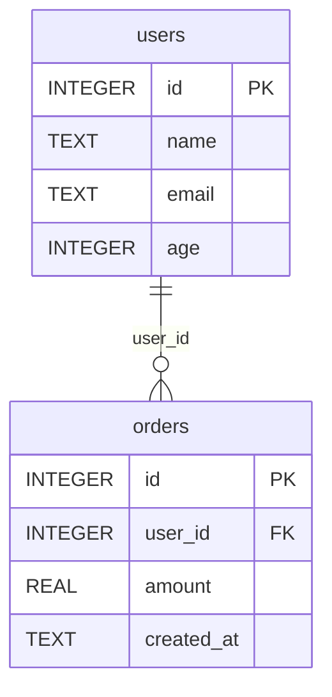

# db-explorer

SQLite / PostgreSQL 数据库只读探索工具 —— 查看表结构、预览数据、生成 ER 图、执行安全查询。

## 能力概览

| 功能 | 说明 |
|------|------|
| 列出所有表 | 显示数据库中的表和视图，含行数统计 |
| 查看表结构 | 列名、类型、约束（PK/FK/NOT NULL）、索引、默认值 |
| 数据预览 | 查看表的前 N 行数据 |
| ER 图生成 | 输出 Mermaid erDiagram 语法，可直接渲染 |
| 安全只读查询 | 仅允许 SELECT/WITH/EXPLAIN，自动拦截写入操作 |

## 安全机制

- **连接层只读**：SQLite 使用 `?mode=ro` URI 打开；PostgreSQL 使用 `SET SESSION READ ONLY`
- **SQL 白名单**：仅允许 SELECT / WITH / EXPLAIN / PRAGMA / SHOW 开头
- **危险关键字拦截**：INSERT、UPDATE、DELETE、DROP、ALTER、CREATE 等 30+ 关键字被阻止
- **多语句拦截**：禁止分号分隔的多条 SQL（防止注入）
- **标识符转义**：表名使用双引号转义，防止 SQL 注入

## Quick Start

```bash
# 列出 SQLite 数据库中的所有表
python3 scripts/db_explorer.py --db-path data.db list-tables

# 查看表结构
python3 scripts/db_explorer.py --db-path data.db describe users

# 预览数据（默认 20 行）
python3 scripts/db_explorer.py --db-path data.db preview orders --limit 10

# 生成 Mermaid ER 图
python3 scripts/db_explorer.py --db-path data.db er-diagram

# 执行只读查询
python3 scripts/db_explorer.py --db-path data.db query "SELECT name, age FROM users WHERE age > 18 LIMIT 10"
```

### PostgreSQL

```bash
# 连接 PostgreSQL
python3 scripts/db_explorer.py --db-type postgres --dsn "host=localhost dbname=mydb user=reader" list-tables

# 查看表结构
python3 scripts/db_explorer.py --db-type postgres --dsn "host=localhost dbname=mydb user=reader" describe orders
```

## 详细用法

### 参数说明

| 参数 | 必填 | 默认值 | 说明 |
|------|------|--------|------|
| `--db-type` | 否 | sqlite | 数据库类型：sqlite 或 postgres |
| `--db-path` | SQLite 时必填 | — | SQLite 数据库文件路径 |
| `--dsn` | PostgreSQL 时必填 | — | PostgreSQL 连接串 |

### 子命令

| 命令 | 说明 | 示例 |
|------|------|------|
| `list-tables` | 列出所有表/视图 | `list-tables` |
| `describe <table>` | 查看表结构详情 | `describe users` |
| `preview <table> [--limit N / -n N]` | 预览前 N 行数据 | `preview orders --limit 5` |
| `er-diagram` | 生成 Mermaid ER 图 | `er-diagram` |
| `query "<sql>"` | 执行只读 SQL | `query "SELECT count(*) FROM users"` |

## 输出示例

### list-tables

```json
[
  {"name": "users", "type": "table", "row_count": 1500},
  {"name": "orders", "type": "table", "row_count": 8200},
  {"name": "user_stats", "type": "view", "row_count": 1500}
]
```

### describe

```json
{
  "table": "orders",
  "row_count": 8200,
  "columns": [
    {"cid": 0, "name": "id", "type": "INTEGER", "notnull": true, "default": null, "primary_key": true},
    {"cid": 1, "name": "user_id", "type": "INTEGER", "notnull": true, "default": null, "primary_key": false},
    {"cid": 2, "name": "amount", "type": "REAL", "notnull": false, "default": "0.0", "primary_key": false}
  ],
  "foreign_keys": [
    {"from": "user_id", "to_table": "users", "to_column": "id"}
  ],
  "indexes": [
    {"name": "idx_orders_user_id", "unique": false, "columns": ["user_id"]}
  ]
}
```

### er-diagram (Mermaid)



## 依赖

- Python 3.8+（`sqlite3` 为内置模块）
- PostgreSQL 支持需安装：`pip install psycopg2-binary`
